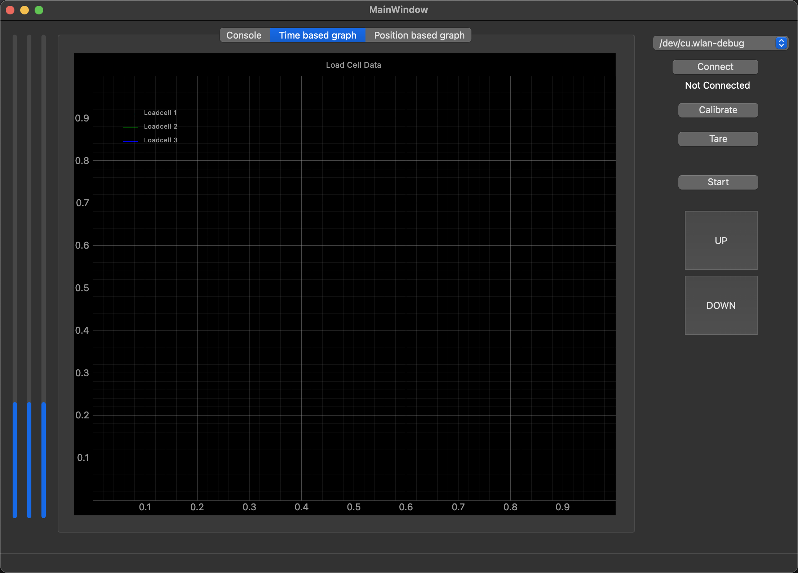

# Thymos Control

## Intro

Software to use Thymos laoding machines.

## Python install

requirements: python, git

- install virtual environment

```sh
python -m venv .venv
MAC source .venv/bin/activate
WIN .venv\Scripts\activate.bat
```

- install requrements

```sh
pip install -r requirements.txt
```

- run

```sh
python src/main/python/main.py
```

## GUI screenshot



## Pack

Convert .ui to .py:
```sh
pyuic6 -o src/ui/design.py src/ui/design.ui
```
Pack to exe
```sh
pyinstaller --noconsole --onefile main.py
```

## Feature list

- configs saved to YAML file